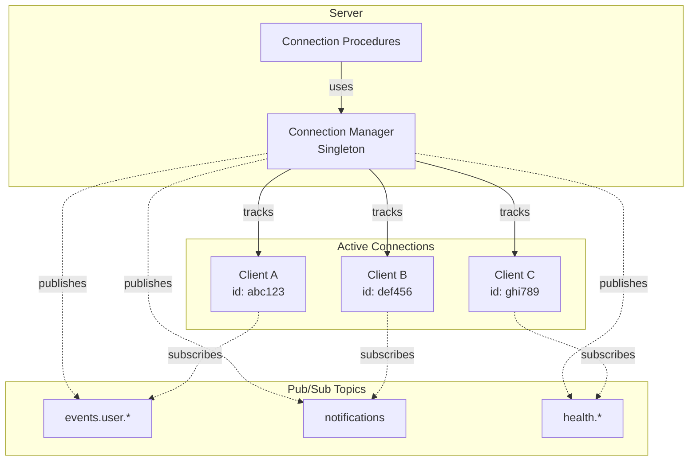
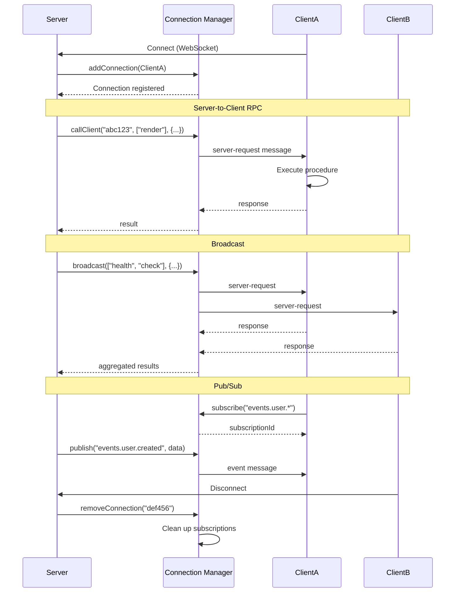

# @mark1russell7/client-connection

[](https://www.npmjs.com/package/@mark1russell7/client-connection)
[](https://opensource.org/licenses/MIT)
[](https://www.typescriptlang.org/)

**Connection management procedures for bidirectional RPC - track clients, call procedures on specific clients, and implement pub/sub messaging.**

## Table of Contents

- [Overview](#overview)
- [Installation](#installation)
- [Architecture](#architecture)
- [Quick Start](#quick-start)
- [API Reference](#api-reference)
- [Use Cases](#use-cases)

## Overview

`@mark1russell7/client-connection` provides procedures for managing bidirectional RPC connections in the Mark ecosystem:

- **Connection Tracking**: List and inspect connected clients
- **Server-to-Client RPC**: Call procedures on specific clients from the server
- **Broadcast**: Execute procedures on all connected clients simultaneously
- **Pub/Sub**: Topic-based publish/subscribe messaging between clients

## Installation

```bash
npm install github:mark1russell7/client-connection#main
```

**Dependencies:**
- `@mark1russell7/client` (peer dependency)
- `zod` ^3.24.0

## Architecture



### Connection Flow



## Quick Start

```typescript
import { Client } from "@mark1russell7/client";
import "@mark1russell7/client-connection/register";

const client = new Client({ /* transport */ });

// List all connected clients
const { connections } = await client.call(["connection", "list"], {});

// Call a procedure on a specific client
const result = await client.call(["connection", "call"], {
  clientId: "abc123",
  path: ["fs", "read"],
  input: { path: "./config.json" },
});

// Broadcast to all clients
await client.call(["connection", "broadcast"], {
  path: ["notification", "show"],
  input: { message: "Server update!" },
});
```

## API Reference

All procedures are automatically registered when you import the package:

```typescript
import "@mark1russell7/client-connection/register";
```

### Procedures Overview

| Procedure | Description |
|-----------|-------------|
| `connection.list` | List all connected clients |
| `connection.get` | Get information about a specific client |
| `connection.call` | Call a procedure on a specific client |
| `connection.broadcast` | Call a procedure on all connected clients |
| `connection.subscribe` | Subscribe to a topic |
| `connection.unsubscribe` | Unsubscribe from a topic |
| `connection.publish` | Publish data to topic subscribers |

### Connection Manager API

The connection manager is a singleton that tracks all active connections:

```typescript
import { connectionManager, getConnectionManager } from "@mark1russell7/client-connection";

// Add a connection
connectionManager.addConnection({
  id: "abc123",
  connectedAt: new Date(),
  metadata: { userAgent: "..." },
  procedures: ["render", "health"],
  send: async (message) => { /* send to client */ },
});

// Get a connection
const conn = connectionManager.getConnection("abc123");

// List all connections
const allConns = connectionManager.getAllConnections();

// Remove a connection
connectionManager.removeConnection("abc123");

// Call a client
const result = await connectionManager.callClient(
  "abc123",
  ["render"],
  { template: "home" },
  30000  // timeout
);

// Broadcast to all clients
const { sent, results } = await connectionManager.broadcast(
  ["health", "check"],
  {},
  { waitForResponses: true, timeout: 5000 }
);

// Subscribe to a topic
const subId = connectionManager.subscribe("abc123", "events.user.*");

// Publish to a topic
const delivered = await connectionManager.publish("events.user.created", {
  userId: "123",
  name: "Alice",
});

// Unsubscribe
connectionManager.unsubscribe(subId);

// Get subscriptions
const subs = connectionManager.getSubscriptions("events.user.*");
```

### connection.list

List all connected clients.

```typescript
interface ListInput {
  serverId?: string;     // Filter by server ID (optional)
}

interface ConnectionInfo {
  id: string;            // Client ID
  connectedAt: string;   // Connection time (ISO)
  metadata?: Record<string, unknown>;
  procedures?: string[]; // Available procedures
}

interface ListOutput {
  connections: ConnectionInfo[];
}
```

### connection.get

Get information about a specific client.

```typescript
interface GetInput {
  clientId: string;      // Client ID
}

interface GetOutput {
  connection: ConnectionInfo | null;
}
```

### connection.call

Call a procedure on a specific client.

```typescript
interface CallInput {
  clientId: string;      // Target client ID
  path: string[];        // Procedure path
  input?: unknown;       // Procedure input
  timeout?: number;      // Timeout in ms
}

interface CallOutput {
  result: unknown;       // Procedure result
  clientId: string;      // Client that was called
}
```

**Example:**
```typescript
// Execute a procedure on a specific client
const result = await client.call(["connection", "call"], {
  clientId: "client-abc",
  path: ["git", "status"],
  input: { cwd: "/home/user/project" },
});
```

### connection.broadcast

Call a procedure on all connected clients.

```typescript
interface BroadcastInput {
  path: string[];        // Procedure path
  input?: unknown;       // Procedure input
  waitForResponses?: boolean;  // Wait for all responses (default: false)
  timeout?: number;      // Timeout in ms
}

interface BroadcastOutput {
  sent: number;          // Number of clients reached
  results?: Array<{
    clientId: string;
    result?: unknown;
    error?: string;
  }>;  // If waitForResponses=true
}
```

**Example:**
```typescript
// Notify all clients
await client.call(["connection", "broadcast"], {
  path: ["notification", "show"],
  input: { message: "Deployment complete!" },
});

// Broadcast and wait for responses
const { results } = await client.call(["connection", "broadcast"], {
  path: ["health", "check"],
  input: {},
  waitForResponses: true,
  timeout: 5000,
});
```

### connection.subscribe

Subscribe to a topic for pub/sub messaging.

```typescript
interface SubscribeInput {
  topic: string;         // Topic to subscribe to
  clientId?: string;     // Client ID (auto-filled from context)
}

interface SubscribeOutput {
  subscriptionId: string;
  topic: string;
}
```

### connection.unsubscribe

Cancel a subscription.

```typescript
interface UnsubscribeInput {
  subscriptionId: string;
}

interface UnsubscribeOutput {
  success: boolean;
  subscriptionId: string;
}
```

### connection.publish

Publish data to all subscribers of a topic.

```typescript
interface PublishInput {
  topic: string;         // Topic to publish to
  data: unknown;         // Data to send
}

interface PublishOutput {
  delivered: number;     // Number of subscribers reached
  topic: string;
}
```

**Example:**
```typescript
// Publisher
await client.call(["connection", "publish"], {
  topic: "events.user.created",
  data: { userId: "123", name: "Alice" },
});

// Subscriber (separate client)
await client.call(["connection", "subscribe"], {
  topic: "events.user.*",
});
```

## Use Cases

### Multi-Client Control

Control multiple clients from a central server:

```typescript
// Get all connected clients
const { connections } = await client.call(["connection", "list"], {});

// Update all clients
for (const conn of connections) {
  await client.call(["connection", "call"], {
    clientId: conn.id,
    path: ["config", "reload"],
    input: {},
  });
}
```

### Real-Time Notifications

Implement real-time notifications with pub/sub:

```typescript
// Subscribe to notifications
await client.call(["connection", "subscribe"], {
  topic: "notifications",
});

// Publish from server
await client.call(["connection", "publish"], {
  topic: "notifications",
  data: { type: "alert", message: "System update in 5 minutes" },
});
```

## License

MIT
